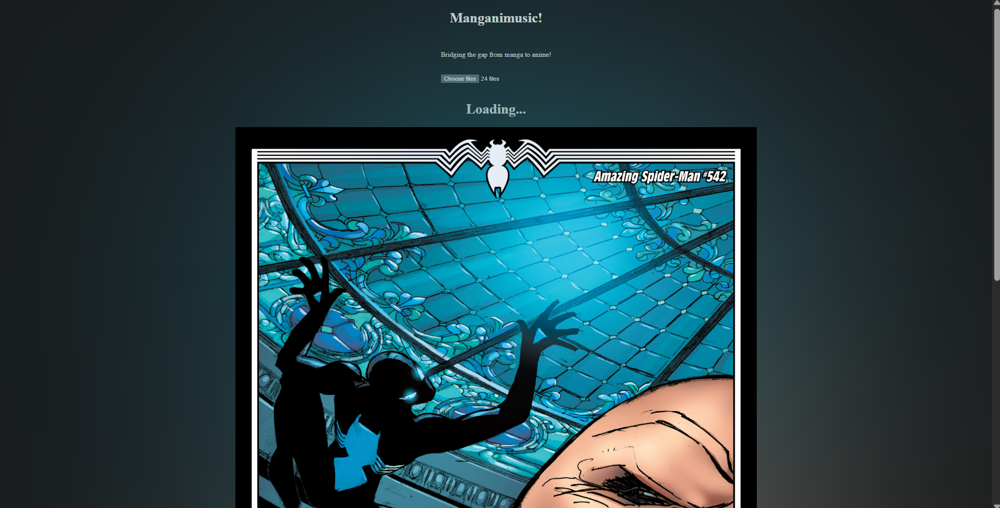

# MangAniMusic

A site that automatically adds music to your manga that aligns with the mood of the story using the gemini api!

Made in 6.5 hours during a hackathon with basically no ai: https://devpost.com/software/animangamusic?ref_content=my-projects-tab&ref_feature=my_projects.

Features:
- Upload your comics and/or manga and read
- Music selected by the gemini api corresponding to the mood of the page you are reading: fights have battle music, dramatic moments have dramatic music, etc.
- Sound effects selected by the gemini api corresponding to what is happening on the page: laser make laser sounds, punches make punch sounds, etc.
- Immersive glow behind the comic corresponding to the color of the page

To use:
- Clone the repo
- add a .env file to the root folder containg the following text: GEMINI_API_KEY=Your_Key_Here
- Install python if you haven't already: https://www.python.org/downloads/
- open a terminal in the root folder
- for linux or git bash (other os' have slightly different commands) run:

```
python -m venv .venv
pip install -r requirements.txt
source .venv/Scripts/activate
flask run
```
  
- open http://127.0.0.1:5000/ in a browser
- upload your comics, wait for it to load and read!

Credits:
- heavy impact by universfield at https://pixabay.com/sound-effects/household-impact-cinematic-boom-02-487858/
- light impact by RibhavAgrawal at https://pixabay.com/sound-effects/film-special-effects-hit-by-a-wood-230542/
- whoosh by DRAGON-STUDIO at https://pixabay.com/sound-effects/film-special-effects-simple-whoosh-382724/
- blast by Hoscalegeek (Freesound) at https://pixabay.com/sound-effects/film-special-effects-laser-zap-90575/
- tension stinger by GD_SALMAN t https://pixabay.com/sound-effects/film-special-effects-tension-stinger-ambience-355381/

This readme was updated after the end of the hackathon.

ai_use.txt containes every ai prompt that was used in the making of this project, mostly just general syntax that happened to be faster to find with an ai overview.
